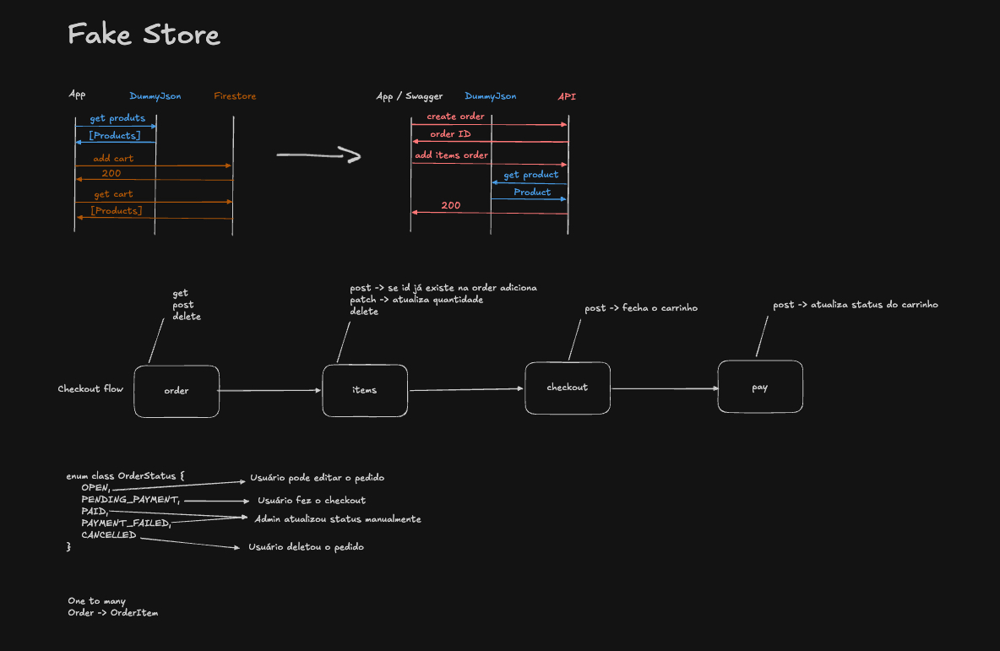

# Desenvolvimento Backend

Trabalho final - Desenvolvimento backend

Vídeo apresentação: https://www.youtube.com/watch?v=iIF9NvQervg

Código com as alterações feitas em aulas + implementação de endpoints para fluxo de checkout com a ideia de ser utilizado futuramente com o projeto desenvolvido anteriormente no curso [Fake Store](https://github.com/christianalexandre/fakestore-compose)

Visualização da ideia:

